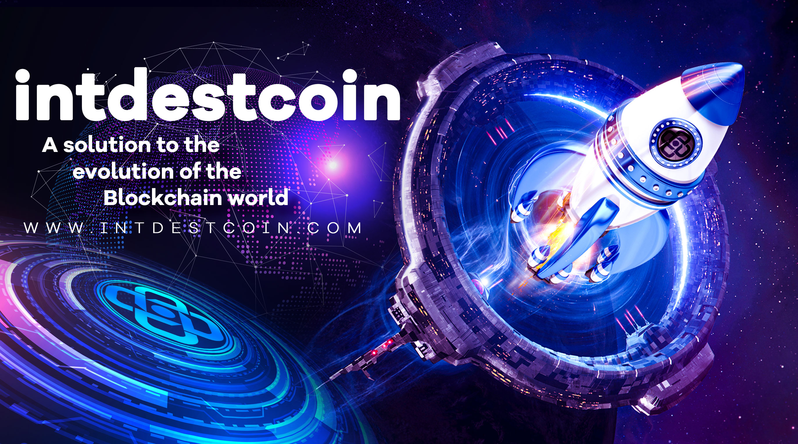

# 
# 
# A solution to the evolution of the Blockchain world
## What Is INTDESTCOIN (INTD)?
INTDESTCOIN is an ecosystem that validates value for anything, anywhere. It has enabled the validation of any digital content with no geographic location restrictions.

> INTDESTCOIN  is a solution to the evolution of the Blockchain world

### INTD: 
To create an integrated financial ecosystem for INTDEST services that includes but is not limited to short selling and hedging tools, an optimized [trading](https://coinmarketcap.com/alexandria/glossary/spot-trading) algorithm from global investors, and [Cryptocurrency](https://coinmarketcap.com/alexandria/glossary/cryptocurrency) [exchange](https://coinmarketcap.com/alexandria/glossary/exchange) using the most popular payment tools.

## What is the reason behind INTD?
* Creating a platform for synchronizing INTDEST services
* The communication [bridge](https://coinmarketcap.com/alexandria/glossary/bridges) of data and information between users, INTDEST services
* Providing [payment](https://coinmarketcap.com/alexandria/glossary/funding-payments) for INTDEST services
* Creating equal shares for users in INTDEST services
Use for governance credentials to identify how network resources are [allocated](https://coinmarketcap.com/alexandria/glossary/allocation)
* Holding and profiting from [staking](https://coinmarketcap.com/alexandria/glossary/staking-pool) INTD
* Receive commission during transfer between XCHAIN network in addition to [STAKE](https://coinmarketcap.com/alexandria/glossary/staking-pool)

## INTD BANK
### Transaction Rewards, Reflection, And Benefits: 
INTD bank is a customized [digital banking](https://coinmarketcap.com/alexandria/glossary/banking-as-a-service-baas) service, provider. it is committed to creating a public bank platform, an open [marketplace](https://coinmarketcap.com/alexandria/glossary/decentralized-marketplace) that empowers small businesses and developers to develop new financial solutions. INTD bank will be offering its own set of [APIs](https://coinmarketcap.com/alexandria/glossary/api) and SDKs and direct integration points with third-party apps and services.

## Supported Networks
# 

## Metaverse Bridge and INTD Coin
The INTD brings together a complete platform. You can buy, store and sell products on an integrated commodity trading platform. In the process of using this platform, you exchange [non-fungible tokens](https://coinmarketcap.com/alexandria/glossary/non-fungible-token) for commodities by using them as a deposit for inventory. It uses [smart contracts](https://coinmarketcap.com/alexandria/glossary/smart-contract) to make sure that the transaction between you and the online trader is secure and reliable. The platform only allows trusted sellers and buyers to trade with each other, which prevents scams and bad traders from disrupting the trading ecosystem.

## Who Are the Founders of INTD?
INTD by Informatics Lab C.A.K INTDEST (International Destination Technology Company) was Established. About C.A.K INTDEST, you can refer to the company's Portal [intdest.com](https://intdest.com) and get the necessary information.

## Services that INTD supports in INTDEST Services:
The services are as follows and you can also access them through [intdest.services](https://intdest.services) website.
* [C.A](https://)  international Protection and Security Services: The company also carries out its activities in different regions of the world, especially nationally.
* [C A K INTDEST:](https://intdest.com/)  International Destination Technology Company
* [INTDEST SERVICES:](https://intdest.services/) Comprehensive website of INTDEST portals.
* [INTDEST XCHAIN:](https://intdest.network/)  A Fully Decentralized Layer-1 [Blockchain](https://coinmarketcap.com/alexandria/glossary/blockchain), It boasts ultra-fast transactions, tiny fees, easy-to-use apps, and is environmentally friendly. The emergence of [XCHAIN](https://coinmarketcap.com/alexandria/glossary/blockchain) could represent a turning point in the realization of this project. [XCHAIN](https://coinmarketcap.com/alexandria/glossary/blockchain) is more than a single name and a [Blockchain](https://coinmarketcap.com/alexandria/glossary/blockchain). On the contrary, it is the strings of love and passion of a group of programmers who weave these strings into the [XCHAIN](https://coinmarketcap.com/alexandria/glossary/blockchain) smart chain.
* [INTDESTCOIN:](https://intdestcoin.com/) A solution to the evolution of the [Blockchain](https://coinmarketcap.com/alexandria/glossary/blockchain) world
* [INTMARKETCAP:](https://intmarketcap.info/) [Cryptocurrency](https://coinmarketcap.com/alexandria/glossary/cryptocurrency) Prices, Charts And Market Capitalizations.
* [INTDEST.IO:](https://intdest.io/) The Birth Of A New Civilization. The Intdest Galaxy Project
* [INTDEST.PRO:](https://intdest.pro/) The official intdest galaxy [NFT](https://coinmarketcap.com/alexandria/glossary/non-fungible-token) market web3 portal.
* [INTDESTCOIN.ORG:](https://intdestfx.net/) The Intdestcoin's Knowledge Base Support Forum.
* [INTDEST.TEACH:](https://intdest.tech/)  Artificial Intelligence Voice Generator & Realistic Text To Speech.
* [INTDEST.ONLINE:](https://intdest.online/) The Third Generation Web Search Engine Project.
* [INTDEST.TV:](https://intdest.live/) C A K Intdest - dedicated streaming video platform.
* [INTDEST.NEWS:](https://intdest.news/) latest [Cryptocurrency](https://coinmarketcap.com/alexandria/glossary/cryptocurrency) , finance , fx & stock market news.
* [INTDEST.TECHNOLOGY:](https://intdest.technology/) The website provides statistics of investments and projects with next-generation technology of the intdest company.
* [INTDEST.SPACE:](https://intdest.space/) Grow your website faster by using intdest.space as your foundation
* [INTDEST.TOOLS:](https://intdest.tools/) Provides useful tools for web programmers
* [INTDEST.SHOP:](https://intdest.shop/) A different [Blockchain](https://coinmarketcap.com/alexandria/glossary/blockchain) online store than anywhere else
* [INTDEST.GAME:](https://intdest.games/) The [Metaverse](https://coinmarketcap.com/alexandria/glossary/metaverse)  World Of The INTDEST GALAXY
* [INTDEST FX](https://intdestfx.net/) GROUP: The Best Choice For Learning And Understanding Financial Markets

## Problems To Solve
The INTD Platform Solves The Problems Of Users Who Want To Increase Transaction Speed, Improve Transaction Safety, Reduce Transaction Costs And Ease The Technical Threshold For Developers. The INTD Platform Aims To Create The World’s First Self-Circulating Ecosystem For [Digital Currency](https://coinmarketcap.com/alexandria/glossary/cryptocurrency).
* It Is Not Possible To Incentivize Financial Transactions Through The Coin.
* Coins Are Not Intended To Be Used As A Currency Or Investment Vehicle.
* A Crypto-Loyalty Platform That Introduces A Solution To The High Transaction Fees.
* The Platform Offers Lower Prices For Holders Who Use The Platform For Daily Transactions.
* Holders Also Get Higher Cash Back For Sharing Their Coins With New Users.
* The Platform Has A Massive Audience Because It Is Easy To Use And Profitable For People Who Share The Coins.
* People Are Looking To Invest In Cryptocurrency And Traditional Assets.
* They Want To Buy Low And Sell High All Day Long.

## Initial Coin Distribution
* 62% Banding and Marketing
* 8% Legal and Financial Overhead
* 3% Gift Code Inventory 
* 14% it infrastructure
* 3% Bounty and Overhead

## Sale Proceed Allocation
* 65% Core phase of the sale
* 3% Bounties
* 9% Bonus and reserve
* 13% Project Team Share
* 10% Partners and Advisors 

